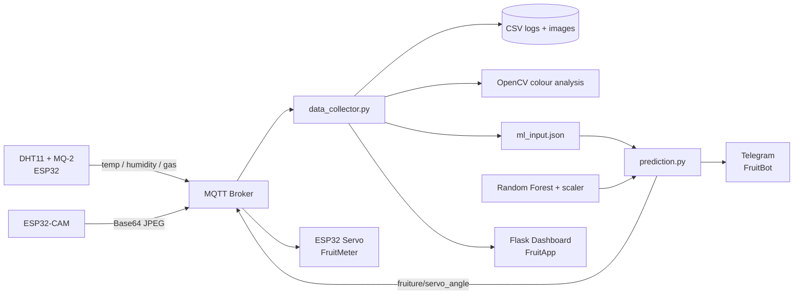

# Fruiture 🍌

**An integrated AI-IoT system for real-time banana ripeness detection and prediction using multi-sensor data fusion.**

<p align="center">
  
</p>

Fruiture combines an **ESP32**, **DHT11 temperature/humidity sensor**, **MQ-2 gas/VOC sensor**, and **ESP32-CAM** with MQTT communication, OpenCV image processing, a Random Forest regression model, a physical servo gauge, Telegram alerts and a Flask monitoring dashboard. The project was developed as a proof-of-concept for low-cost, objective freshness monitoring and food-waste reduction.

> **Team:** Du Yanzhang, Fang Tianchi, Feng Yilong, Liu Hengyi  
> **Project report date:** 20 Nov 2025

## What the system does

Fruiture observes banana ripening from three complementary signals:

- **Environmental:** temperature and humidity from DHT11
- **Chemical:** gas/VOC proxy from MQ-2
- **Visual:** banana skin colour from ESP32-CAM + OpenCV

The backend fuses these readings into a 7-feature ML input (`max_gas`, `avg_gas`, `temperature`, `humidity`, `R`, `G`, `B`) and predicts a **Day 1-Day 5** ripeness index.

<p align="center">
  
</p>

## End-to-end architecture



## Machine-learning result

The report compares Polynomial Regression with Random Forest Regression. Random Forest was selected as the deployment model. Reported performance:

| Metric | Random Forest |
|---|---:|
| 10-fold CV mean R² | **0.92 ± 0.131** |
| Final test MAE | **0.193 day** |
| Final test RMSE | **0.324 day** |
| Final test R² | **0.915** |

These results come from a **small proof-of-concept dataset (10 bananas over Day 1-Day 5)**, so they should not be interpreted as production-level generalization.

## User-facing outputs

<table>
<tr>
<td width="33%" align="center"><br><b>FruitMeter</b><br>Physical servo ripeness gauge</td>
<td width="33%" align="center"><br><b>FruitBot</b><br>Telegram updates & spoilage alerts</td>
<td width="33%" align="center"><br><b>FruitApp</b><br>Flask live dashboard</td>
</tr>
</table>

## Computer-vision pipeline

`banana_detector_no_grey.py` performs lightweight color-based analysis instead of a deep neural network:

1. Convert BGR → HSV and smooth the frame.
2. Apply CLAHE to normalize illumination.
3. Segment green, yellow, brown and black banana-skin regions.
4. Reject low-saturation gray/background regions.
5. Clean masks with morphology and extract the largest valid contour.
6. Calculate RGB statistics, color proportions and a visual ripeness score.

This keeps the pipeline computationally light while providing visual features to the regression model.

## Repository structure

```text
Fruiture-AI-IoT/
├── assets/                  # Prototype, dashboard, bot, architecture images
├── data/
│   ├── live/                # Example runtime logs
│   ├── raw_sensor/          # Day 1-Day 5 sensor CSVs
│   ├── sample_images/       # Representative camera frames
│   └── training/            # Training workbook
├── docs/
│   ├── CS3237_Group13_Report.pdf
│   ├── Fruiture_Presentation.pptx
│   ├── TECHNICAL_OVERVIEW.md
│   ├── MQTT_TOPICS.md
│   └── RUNNING.md
├── firmware/
│   ├── sensor_node/         # DHT11 + MQ-2 MQTT firmware
│   ├── camera_final/        # Final ESP32-CAM MQTT firmware
│   ├── servo/               # FruitMeter actuator firmware
│   └── experiments/         # Earlier camera prototypes
├── hardware/                # CAD / fabrication files
└── src/fruiture/
    ├── data_collector.py
    ├── banana_detector_no_grey.py
    ├── prediction.py
    ├── model_regression.py
    ├── banana_regression_model.pkl
    ├── banana_scaler.pkl
    └── templates/index.html
```

## Quick start

```bash
python -m venv .venv
# activate the environment, then:
pip install -r requirements.txt
cd src/fruiture
python data_collector.py
```

The dashboard is served at **http://localhost:5001**. After an `ml_input.json` summary is generated, run:

```bash
python prediction.py
```

See [`docs/RUNNING.md`](docs/RUNNING.md) for the full setup, including firmware and Telegram configuration.

## MQTT

The prototype communicates through `broker.hivemq.com:1883` using the `fruiture/` topic namespace. See [`docs/MQTT_TOPICS.md`](docs/MQTT_TOPICS.md) for the topic map. A private broker and unique namespace should be used outside a classroom/demo environment.

## Hardware / experimental design

The report describes sensor calibration and a controlled sensing enclosure. DHT11 measurements were calibrated against a reference hygrometer, MQ-2 measurements used warm-up/baseline calibration and averaging, and the camera operated under fixed illumination. A 470 µF capacitor was added across the supply rails to reduce voltage dips caused by the MQ-2 heater load.

Data were collected in two batches of five bananas. The project uses a fixed 10-minute feature window for the live-demo pipeline; max/average gas, averaged temperature/humidity and RGB features feed the model.

## Live demonstration

During the reported demo, a Day-4 banana was correctly predicted as Day 4; the servo gauge moved to 4, the Telegram bot sent the status, and the web dashboard displayed the live measurements.

<p align="center">
  
</p>

## Limitations & next steps

The report identifies four main limitations: gas leakage sensitivity, inconsistent banana placement, lighting drift as batteries discharge, and a small/non-diverse dataset. Proposed extensions include larger and more diverse datasets, periodic model retraining, support for other fruit types, and cloud data storage/analytics.

## Project report

The complete technical report is available here: [`docs/CS3237_Group13_Report.pdf`](docs/CS3237_Group13_Report.pdf).

## Security

No live credentials are included in this repository. Wi-Fi values were replaced with placeholders and Telegram credentials are represented only by `BotAPI.example.txt`. See [`SECURITY.md`](SECURITY.md).
