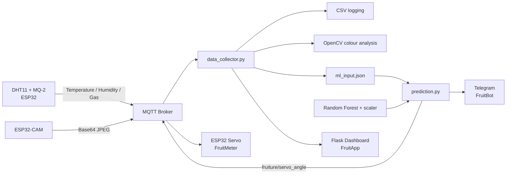

# Fruiture 🍌

**An integrated AI-IoT system for real-time banana ripeness detection and prediction using multi-sensor data fusion.**

Fruiture combines **ESP32 embedded sensing, DHT11 temperature/humidity measurements, MQ-2 gas/VOC sensing, ESP32-CAM visual monitoring, MQTT, OpenCV, Random Forest regression, a servo FruitMeter, Telegram alerts and a Flask dashboard** into an end-to-end freshness-monitoring prototype.

> **Team:** Du Yanzhang, Fang Tianchi, Feng Yilong, Liu Hengyi  
> **Final report:** 20 Nov 2025

## System concept

Banana ripeness is observed through three complementary modalities:

- **Environmental:** temperature and humidity from DHT11
- **Chemical:** VOC-related gas signal from MQ-2
- **Visual:** banana-skin colour from ESP32-CAM + OpenCV

The backend converts these readings into the final ML feature vector:

`[Max_gas, Average_Gas, temperature, humidity, R, G, B]`

and predicts a **Day 1–5 ripeness stage**.

## End-to-end architecture



## Machine-learning results

The final report compares Polynomial Regression with Random Forest Regression. Random Forest was selected for deployment.

| Metric | Random Forest |
|---|---:|
| 10-fold CV mean R² | **0.92 ± 0.131** |
| Final test MAE | **0.193 day** |
| Final test RMSE | **0.324 day** |
| Final test R² | **0.915** |

These results come from a **small proof-of-concept dataset involving 10 bananas across Day 1–5**, so they should not be interpreted as production-level generalization.

## Computer-vision pipeline

`banana_detector_no_grey.py` implements a lightweight OpenCV pipeline instead of a deep neural network:

1. Convert BGR → HSV.
2. Apply CLAHE brightness normalization.
3. Segment green, yellow, brown and black peel regions.
4. Reject low-saturation gray/background areas.
5. Apply morphological cleanup and contour extraction.
6. Calculate RGB statistics, colour proportions and a visual ripeness score.

## IoT and backend

The sensor/camera nodes publish through the public HiveMQ broker using the `fruiture/` MQTT namespace. `data_collector.py` subscribes to the streams, logs readings, reconstructs camera frames, extracts visual features and periodically generates the ML input used by `prediction.py`.

The prediction then drives two user-facing outputs:

- **FruitMeter:** servo-actuated physical Day 1–5 ripeness gauge
- **FruitBot:** Telegram ripeness updates and spoilage warnings

A Flask **FruitApp** dashboard provides live and historical monitoring.

## Repository structure

```text
Fruiture-AI-IoT/
├── README.md
├── SECURITY.md
├── requirements.txt
├── data/
│   └── README.md
├── docs/
│   ├── REPORT_SUMMARY.md
│   ├── TECHNICAL_OVERVIEW.md
│   ├── MQTT_TOPICS.md
│   ├── RUNNING.md
│   └── SOURCE_ARCHIVES.md
├── firmware/
│   ├── sensor_node/mqtt_dht11.ino
│   ├── camera_final/camara_final_sleep.ino
│   └── servo/servo_1.ino
└── src/fruiture/
    ├── data_collector.py
    ├── banana_detector_no_grey.py
    ├── model_regression.py
    ├── prediction.py
    ├── dataset3_app.csv
    ├── BotAPI.example.txt
    └── templates/index.html
```

## Quick start

```bash
python -m venv .venv
# activate the environment
pip install -r requirements.txt
cd src/fruiture
python model_regression.py
python data_collector.py
```

`model_regression.py` regenerates the Random Forest model and scaler from the included CSV dataset. The dashboard is then available at:

`http://localhost:5001`

After `data_collector.py` produces `ml_input.json`:

```bash
python prediction.py
```

See [`docs/RUNNING.md`](docs/RUNNING.md) for the complete setup.

## MQTT topics

Key topics include:

- `fruiture/temp`
- `fruiture/humidity`
- `fruiture/mq2gas`
- `fruiture/Base64image`
- `fruiture/ml_input`
- `fruiture/servo_angle`

See [`docs/MQTT_TOPICS.md`](docs/MQTT_TOPICS.md) for details.

## Experimental design

The project collected data in two batches of five bananas. A fixed 10-minute feature window was used for the live demonstration pipeline. Mutual Information analysis supported the use of gas, environmental and RGB features, with maximum/average gas readings being the most informative signals in the collected dataset.

## Live demonstration

In the reported live demo, a Day-4 banana was correctly predicted as Day 4. The FruitMeter moved to 4, the Telegram bot sent the corresponding status update, and the web dashboard displayed the live sensor information.

## Limitations and future work

The final report identifies several practical limitations:

- MQ-2 sensitivity to enclosure leakage
- variation in banana placement relative to sensors
- lighting drift as the battery voltage declines
- limited dataset size and banana diversity

Future extensions include larger and more diverse datasets, periodic model retraining, additional fruit types and cloud-based storage/analytics.

For a report-derived technical overview, see [`docs/REPORT_SUMMARY.md`](docs/REPORT_SUMMARY.md).

## Security

**No live credentials are committed.** Wi-Fi credentials are placeholders and Telegram configuration is represented by `BotAPI.example.txt`. See [`SECURITY.md`](SECURITY.md).
